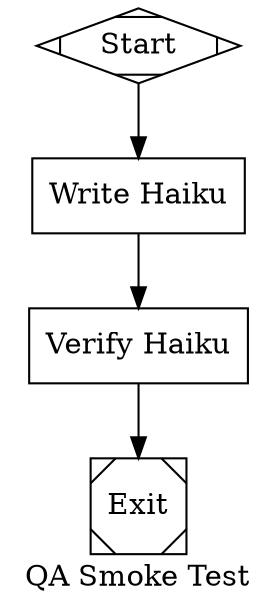
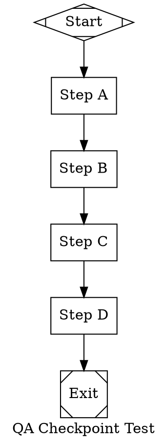
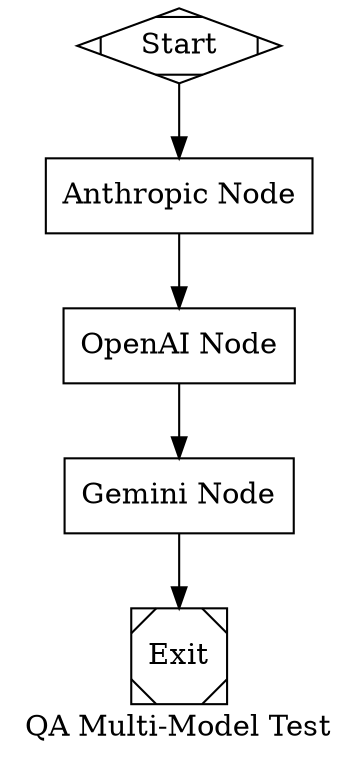

# QA Plan — Spec Completion Implementation

Verify that all features from SPEC-COMPLETION-PLAN.md phases 1-8 actually work.

**Current state**: 263 tests pass, build clean. But many new features only have "does the type exist" tests — not behavioral tests that prove the feature works end-to-end.

---

## Coverage Summary

| Phase | Feature | Has Tests | Tests Behavioral? | Verdict |
|-------|---------|-----------|-------------------|---------|
| 1.1 | Codex 5.3 in catalog | Yes | Yes (lookup by ID + alias) | OK |
| 1.2 | StylesheetTransform reasoning_effort fix | Yes | Yes (apply + no-override) | OK |
| 1.3 | NullCodergenBackend returns Success | Yes | Partial (status only, not message format) | OK |
| 1.4 | ToolHandler tool_command attribute | Yes | Partial (tool_command works, but no fallback priority test) | **GAP** |
| 1.5 | Session abort → Closed | Yes | Yes | OK |
| 1.6 | Checkpoint timestamp + logs | Yes | Yes (roundtrip) | OK |
| 2.1 | grep glob_filter/case_insensitive/max_results | Yes | **No** (only checks param exists on definition) | **GAP** |
| 2.2 | glob path param | Yes | **No** (only checks param exists on definition) | **GAP** |
| 2.3 | Gemini list_dir | Yes | **No** (only checks tool registered) | **GAP** |
| 2.4 | Gemini read_many_files | Yes | **No** (only checks tool registered) | **GAP** |
| 2.5 | ToolHandler timeout + env-var filtering | No | **No** | **GAP** |
| 3.1 | OpenAI reasoning effort | Pre-existing | Yes (already in adapter) | OK |
| 3.2 | Streaming middleware | No | **No** | **GAP** |
| 3.3 | RateLimitInfo + Warnings | Pre-existing | N/A (fields exist, parsing is provider-side) | OK |
| 3.4 | Anthropic cache breakpoint on tool_result | No | **No** | **GAP** |
| 3.5 | Provider options for OpenAI/Gemini | No | **No** | **GAP** |
| 4.1 | Parallel tool calls in Session | No | **No** | **GAP** |
| 4.2 | Parallel handler join/error/max policies | Partial | **Partial** (only ignore policy tested) | **GAP** |
| 4.3 | Parallel handler isolated context | Yes | Yes | OK |
| 4.4 | Multi-hop subgraph execution | No | **No** (not implemented — single-hop only) | **GAP** |
| 4.5 | Fan-in handler | Yes | Yes (empty + heuristic ranking) | OK |
| 5.1 | WaitHuman timeout/skip/default | Yes | Yes (3 scenarios) | OK |
| 5.2 | Codergen preferred_label | Yes | Partial (preferred_label forwarded, no suggested_next_ids test) | OK |
| 6.1 | Subagent tools registration | No | **No** (tools exist but no execution test) | **GAP** |
| 6.2 | Subagent lifecycle | Partial | **Partial** (spawn/close/get tested, not send_input/wait_agent execution) | **GAP** |
| 6.3 | Depth limiting | Yes | Yes | OK |
| 7.1 | ManagerLoopHandler | Yes | Partial (no-backend path only, no cycle/stop test) | **GAP** |
| 7.2 | INITIALIZE phase | Yes | Yes (graph attrs in context) | OK |
| 7.3 | FINALIZE phase | Yes | Yes (duration/status in context) | OK |
| 7.4 | Checkpoint fidelity degradation | No | **No** | **GAP** |
| 7.5 | Additional lint rules | Yes | Yes (all 3 rules) | OK |
| 8.1 | Project docs discovery | Yes | Yes (missing dir, empty dir, finds CLAUDE.md) | OK |
| 8.2 | Provider-aligned prompts | N/A | N/A (best-effort, not testable) | OK |
| 8.3 | ProviderOptions on requests | No | **No** | **GAP** |

---

## Tests to Add

### Priority 1 — Behavioral tests for code paths that have zero coverage

#### T1. grep execution with new params
**File**: `CodingAgentTests.cs`
**What**: Create a `LocalExecutionEnvironment` on a temp dir with known files, call `GrepAsync` with `globFilter: "*.cs"`, `caseInsensitive: true`, `maxResults: 2` and verify each param affects output.
```
- glob_filter="*.txt" excludes .cs files from results
- case_insensitive=true matches "FOO" when searching for "foo"
- max_results=2 returns at most 2 results even when more match
```

#### T2. glob execution with path param
**File**: `CodingAgentTests.cs`
**What**: Create nested temp dirs, call `GlobAsync("*.txt", path: subDir)` and verify only files in `subDir` are returned, not files in parent.

#### T3. list_dir execution
**File**: `CodingAgentTests.cs`
**What**: Create temp dir with files and subdirs, call `ListDirectoryAsync`, verify output contains `[DIR]` and `[FILE]` markers with correct names. Also test non-existent path returns error string.

#### T4. read_many_files execution
**File**: `CodingAgentTests.cs`
**What**: Create 3 temp files, call `ReadManyFilesAsync` with their paths, verify concatenated output contains all file contents separated by `=== path ===` headers. Test with one non-existent file to verify partial success.

#### T5. ToolHandler timeout enforcement
**File**: `AttractorTests.cs`
**What**: Create a ToolHandler node with `timeout=500` and `tool_command="sleep 10"`. Verify it returns `OutcomeStatus.Fail` with "timed out" in notes within ~1 second (not 10).

#### T6. ToolHandler env-var filtering
**File**: `AttractorTests.cs`
**What**: Set `MY_API_KEY=secret` in the environment, create a ToolHandler node with `tool_command="env | grep MY_API_KEY"`. Verify stdout is empty (the var was stripped).

#### T7. ToolHandler attribute priority
**File**: `AttractorTests.cs`
**What**: Create node with both `tool_command="echo primary"` and `command="echo fallback"`. Verify stdout contains "primary". Then test with only `command` set.

#### T8. Parallel handler first_success join policy
**File**: `AttractorTests.cs`
**What**: Create parallel node with `join_policy=first_success`. One branch succeeds, one fails. Verify combined outcome is `Success`.

#### T9. Parallel handler fail_fast error policy
**File**: `AttractorTests.cs`
**What**: Create parallel node with `error_policy=fail_fast`. One branch fails. Verify the handler returns `Fail` and other branches are cancelled.

#### T10. Parallel handler max_parallel concurrency cap
**File**: `AttractorTests.cs`
**What**: Create parallel node with `max_parallel=1` and 3 branches. Verify they execute (functional test — can't easily verify sequentiality, but can verify all complete).

#### T11. Streaming middleware transforms request
**File**: `UnifiedLlmTests.cs`
**What**: Create a Client with a middleware that sets `request.Model = "transformed"`. Call `StreamAsync`, verify the provider receives the transformed model name.

#### T12. Anthropic cache breakpoint on tool_result
**File**: `UnifiedLlmTests.cs`
**What**: Build an Anthropic request body with a conversation containing tool_result messages. Verify the JSON output has `cache_control` on the last tool_result block but not on earlier ones.

#### T13. Provider options pass-through
**File**: `UnifiedLlmTests.cs`
**What**: Build an OpenAI request body with `ProviderOptions = { ["store"] = true }`. Verify `"store": true` appears in the serialized JSON body. Same for Gemini.

#### T14. ManagerLoopHandler with backend and max_cycles
**File**: `AttractorTests.cs`
**What**: Create ManagerLoopHandler with a counting backend and `max_cycles=3`. Verify it runs exactly 3 cycles and returns `PartialSuccess`. Verify `{node_id}.cycles = "3"` in context.

#### T15. ManagerLoopHandler stop_condition
**File**: `AttractorTests.cs`
**What**: Create ManagerLoopHandler with a backend that sets `context["done"] = "true"` on cycle 2, and `stop_condition="context.done=true"`. Verify it stops after 2 cycles, not max.

#### T16. Checkpoint fidelity degradation on resume
**File**: `AttractorTests.cs`
**What**: Save a checkpoint at node B (with node A completed). Run the engine — verify node B's fidelity is set to `summary:high` (degraded from default `full`/empty).

### Priority 2 — Behavioral tests for partially-covered paths

#### T17. Session parallel tool execution
**File**: `CodingAgentTests.cs`
**What**: Create a session with a provider that returns 3 tool calls. Verify all 3 results are returned. (Can't easily verify parallelism, but verifies the Task.WhenAll path doesn't break.)

#### T18. Session ProviderOptions attached to request
**File**: `CodingAgentTests.cs`
**What**: Create a FakeProfile that returns `ProviderOptions() => { ["custom"] = "value" }`. Create a capturing provider that records the request. Verify `request.ProviderOptions["custom"] == "value"`.

#### T19. Subagent tools are registered on profiles
**File**: `CodingAgentTests.cs`
**What**: Create each profile, call `RegisterSubagentTools()`, verify `spawn_agent`, `send_input`, `wait_agent`, `close_agent` are all present in `Tools()`.

#### T20. CodergenResult suggested_next_ids forwarded
**File**: `AttractorTests.cs`
**What**: Create a backend that returns `SuggestedNextIds: ["node_a", "node_b"]`. Verify the Outcome has the same list.

---

## Implementation Notes

- Tests T5 and T6 spawn real processes — mark with `[Fact]` not `[SkippableFact]` since they use basic OS commands (`sleep`, `env`).
- Tests T11-T13 need to inspect serialized JSON — build the request body via adapter methods and parse the JSON output.
- Test T16 requires saving a checkpoint to disk, then running the engine and inspecting the modified node.
- For T9 (fail_fast), the test needs a slow-succeeding branch and a fast-failing branch to verify cancellation.

## Execution

```bash
dotnet test
```

All tests must pass. Target: ~283 tests (263 existing + 20 new).

## Non-Automated QA — Agentic Validation via qa-agent

These scenarios require real LLM calls, running processes, and HTTP validation. We use `~/qa-agent` to automate them.

### Overview

```
scripts/qa-harness.sh
  ├── Builds soulcaster
  ├── Runs test dotfiles (real LLM calls)
  ├── Starts web dashboard
  ├── Invokes qa-agent per scenario (api surface → HTTP assertions)
  └── Collects results to qa-results/<timestamp>/
```

**Prerequisites**: `ANTHROPIC_API_KEY`, `OPENAI_API_KEY` set. `GEMINI_API_KEY` optional (scenario 4 skipped without it).

**Estimated cost**: ~$0.10–0.50 per full harness run (haiku for smoke/checkpoint, one call each for multi-model).

---

### Test Dotfiles to Create

#### `dotfiles/qa-smoke.dot` — Minimal smoke test (2 nodes, haiku)



**Why**: Cheapest model, 2 nodes, exercises full pipeline loop (parse → start → execute → checkpoint → next → checkpoint → exit). Tests inter-node artifact continuity.

#### `dotfiles/qa-checkpoint.dot` — 4-node pipeline for kill/resume



**Why**: 4 sequential nodes with dependencies. Kill after step_b completes, resume should pick up at step_c.

#### `dotfiles/qa-multimodel.dot` — 3 providers in one pipeline



**Why**: Each node uses a different provider via the model stylesheet class system. Verifies routing works end-to-end.

---

### Scenario Definitions

#### Scenario 1: Real LLM Calls

| Step | Action |
|------|--------|
| 1 | `dotnet run --project runner -- run dotfiles/qa-smoke.dot` |
| 2 | Start web dashboard: `dotnet run --project runner -- web --port 5099 &` |
| 3 | qa-agent verifies via API surface |

**qa-agent invocation**:
```bash
go run ~/qa-agent/cmd/qa-agent run \
  --feature "The pipeline runner completed a smoke test. GET http://localhost:5099/api/pipelines returns JSON array with status 200 containing at least one entry. GET http://localhost:5099/api/pipeline/{id}/status returns JSON with status field equal to completed and a nodes array where each node has status done." \
  --surfaces api --budget-steps 50 --budget-minutes 5
```

**Pass criteria**:
- Pipeline exits 0
- `output/qa-smoke/logs/checkpoint.json` exists with `Timestamp` field
- `output/qa-smoke/logs/result.json` exists
- Each node has `status.json` and non-empty `response.md`
- qa-agent API checks return 200

#### Scenario 2: Resume from Checkpoint

| Step | Action |
|------|--------|
| 1 | Run `qa-checkpoint.dot` in background |
| 2 | Poll `checkpoint.json` until `CompletedNodes` has ≥3 entries (start + step_a + step_b) |
| 3 | Kill the pipeline process |
| 4 | Save pre-resume checkpoint for comparison |
| 5 | Restart: `dotnet run --project runner -- run dotfiles/qa-checkpoint.dot` |
| 6 | qa-agent verifies all 4 steps completed after resume |

**qa-agent invocation**:
```bash
go run ~/qa-agent/cmd/qa-agent run \
  --feature "A pipeline was interrupted and resumed. GET http://localhost:5099/api/pipeline/{id}/status returns JSON with status completed. The nodes array contains step_a and step_b and step_c and step_d all with status done." \
  --surfaces api --budget-steps 50 --budget-minutes 5
```

**Pass criteria**:
- Pre-kill checkpoint shows step_a, step_b completed
- Post-resume `result.json` exists
- All 4 step nodes in final `CompletedNodes`
- Post-resume checkpoint timestamp > pre-kill timestamp

#### Scenario 3: Web Dashboard

| Step | Action |
|------|--------|
| 1 | Dashboard already running from scenario 1 |
| 2 | qa-agent validates all API endpoints |

**qa-agent invocation**:
```bash
go run ~/qa-agent/cmd/qa-agent run \
  --feature "The web dashboard is at http://localhost:5099. GET / returns HTML with status 200. GET /api/pipelines returns a JSON array with status 200. GET /api/queue returns a JSON array with status 200. For a pipeline ID from /api/pipelines, GET /api/pipeline/{id}/status returns JSON with status 200 containing status and nodes fields. GET /api/pipeline/{id}/summaries returns JSON with status 200. GET /api/pipeline/{id}/logs returns a JSON array with status 200." \
  --surfaces api --budget-steps 100 --budget-minutes 10
```

**Pass criteria**:
- `GET /` → 200, HTML body
- `GET /api/pipelines` → 200, JSON array
- `GET /api/queue` → 200, JSON array
- `GET /api/pipeline/{id}/status` → 200, has `status`, `nodes`, `current_node`
- `GET /api/pipeline/{id}/summaries` → 200, has `nodes` object
- `GET /api/pipeline/{id}/logs` → 200, JSON array

#### Scenario 4: Multi-Model Pipeline (requires GEMINI_API_KEY)

| Step | Action |
|------|--------|
| 1 | `dotnet run --project runner -- run dotfiles/qa-multimodel.dot` |
| 2 | qa-agent verifies all 3 provider nodes completed |

**qa-agent invocation**:
```bash
go run ~/qa-agent/cmd/qa-agent run \
  --feature "A multi-model pipeline completed. GET http://localhost:5099/api/pipelines returns a JSON array with status 200 containing a pipeline. GET http://localhost:5099/api/pipeline/{id}/status returns JSON with status completed and nodes array containing anthropic_node and openai_node and gemini_node all with status done." \
  --surfaces api --budget-steps 50 --budget-minutes 5
```

**Pass criteria**:
- Pipeline exits 0, `result.json` exists
- `status.json` exists for all 3 nodes with `"status": "success"`
- Each node has non-empty `response.md`
- Provider field in each `status.json` matches expected provider

---

### Harness Script: `scripts/qa-harness.sh`

Orchestrates all 4 scenarios sequentially:

```
1. Build soulcaster (dotnet build)
2. Check API keys (ANTHROPIC_API_KEY required, OPENAI_API_KEY required, GEMINI_API_KEY optional)
3. Clean prior QA output dirs
4. Run scenario 1: execute qa-smoke.dot, start web dashboard, run qa-agent
5. Run scenario 2: start qa-checkpoint.dot, poll checkpoint, kill, resume, run qa-agent
6. Run scenario 3: run qa-agent against dashboard endpoints
7. Run scenario 4 (if GEMINI_API_KEY set): execute qa-multimodel.dot, run qa-agent
8. Collect all results to qa-results/<timestamp>/
9. Print summary: scenario → pass/fail/skipped
```

**Output structure**:
```
qa-results/20260225-143000/
  harness.log                    # Full harness output
  build.log                      # dotnet build output
  scenario1-run.log              # Pipeline stdout for smoke test
  scenario1-qa-agent.log         # qa-agent output
  scenario2-resume.log           # Pipeline stdout for resume
  scenario2-qa-agent.log
  checkpoint-before-resume.json  # Saved pre-kill checkpoint
  scenario3-qa-agent.log
  scenario4-run.log
  scenario4-qa-agent.log
  qa-agent-scenario1/            # qa-agent run artifacts
  qa-agent-scenario2/
  qa-agent-scenario3/
  qa-agent-scenario4/
```

---

### Files to Create

| File | Purpose |
|------|---------|
| `dotfiles/qa-smoke.dot` | Minimal 2-node smoke test (haiku) |
| `dotfiles/qa-checkpoint.dot` | 4-node pipeline for kill/resume |
| `dotfiles/qa-multimodel.dot` | 3-provider routing test |
| `scripts/qa-harness.sh` | Orchestration script for all 4 scenarios |

### Files to Modify

| File | Change |
|------|--------|
| `QA-PLAN.md` | Already updated (this section) |
